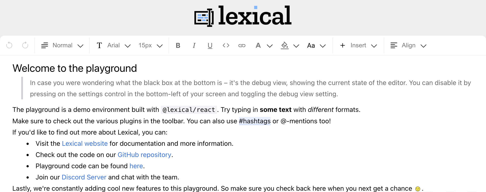

# Nodes

## What are Nodes?

Having learnt about [Editor State](editor-state), we now introduct **how _editor texts_ (or _editor contents_) are
encoded** in Lexical. This is very important if someone needs to parse the editor contents. For example, we may need to
grab everything user enters in the text area and count how many words the user has entered.

Texts in editor are encoded in a giant JSON document. For example, suppose the user has edited the following rich-text
content shown below:



The user contents above, in Lexical, are represented by the following JSON structure store in `editorSate`:

- Each JSON field below `"editorState"` is a **Node**
- A node has one or more **children**
- A line of ascii text is wrapped in a [TextNode](#textnode) of _single child_. A line mixed with ascii text and 
  formatted text is wrapped in a TextNode of _multiple children_. 
- Two nodes are **siblings** if both of them are wrapped inside the same **Node**. For example, a line of text
  including an ascii word and formatted word is a TextNode with two children, with the ascii TextNode and formatted 
  TextNode being the siblings
- To get the previous line of the current line, one needs to jump to its parent and then its parents previous sibling,
  i.e. `currentLineTextNode.getParent().getPreviousSibling().getTextContent();`

```json
{
    "editorState":{
        "root":{
            "children":[
                {
                    "children":[
                        {
                            "detail":0,
                            "format":0,
                            "mode":"normal",
                            "style":"",
                            "text":"Welcome to the playground",
                            "type":"text",
                            "version":1
                        }
                    ],
                    "direction":"ltr",
                    "format":"",
                    "indent":0,
                    "type":"heading",
                    "version":1,
                    "tag":"h1"
                },
                {
                    "children":[
                        {
                            "detail":0,
                            "format":0,
                            "mode":"normal",
                            "style":"",
                            "text":"In case you were wondering what the black box at the bottom is – it's the debug view, showing the current state of the editor. You can disable it by pressing on the settings control in the bottom-left of your screen and toggling the debug view setting.",
                            "type":"text",
                            "version":1
                        }
                    ],
                    "direction":"ltr",
                    "format":"",
                    "indent":0,
                    "type":"quote",
                    "version":1
                },
                {
                    "children":[
                        {
                            "detail":0,
                            "format":0,
                            "mode":"normal",
                            "style":"",
                            "text":"The playground is a demo environment built with ",
                            "type":"text",
                            "version":1
                        },
                        {
                            "detail":0,
                            "format":16,
                            "mode":"normal",
                            "style":"",
                            "text":"@lexical/react",
                            "type":"text",
                            "version":1
                        },
                        {
                            "detail":0,
                            "format":0,
                            "mode":"normal",
                            "style":"",
                            "text":". Try typing in ",
                            "type":"text",
                            "version":1
                        },
                        {
                            "detail":0,
                            "format":1,
                            "mode":"normal",
                            "style":"",
                            "text":"some text",
                            "type":"text",
                            "version":1
                        },
                        {
                            "detail":0,
                            "format":0,
                            "mode":"normal",
                            "style":"",
                            "text":" with ",
                            "type":"text",
                            "version":1
                        },
                        {
                            "detail":0,
                            "format":2,
                            "mode":"normal",
                            "style":"",
                            "text":"different",
                            "type":"text",
                            "version":1
                        },
                        {
                            "detail":0,
                            "format":0,
                            "mode":"normal",
                            "style":"",
                            "text":" formats.",
                            "type":"text",
                            "version":1
                        }
                    ],
                    "direction":"ltr",
                    "format":"",
                    "indent":0,
                    "type":"paragraph",
                    "version":1
                },
                {
                    "children":[
                        {
                            "detail":0,
                            "format":0,
                            "mode":"normal",
                            "style":"",
                            "text":"Make sure to check out the various plugins in the toolbar. You can also use ",
                            "type":"text",
                            "version":1
                        },
                        {
                            "detail":0,
                            "format":0,
                            "mode":"normal",
                            "style":"",
                            "text":"#hashtags",
                            "type":"hashtag",
                            "version":1
                        },
                        {
                            "detail":0,
                            "format":0,
                            "mode":"normal",
                            "style":"",
                            "text":" or @-mentions too!",
                            "type":"text",
                            "version":1
                        }
                    ],
                    "direction":"ltr",
                    "format":"",
                    "indent":0,
                    "type":"paragraph",
                    "version":1
                },
                {
                    "children":[
                        {
                            "detail":0,
                            "format":0,
                            "mode":"normal",
                            "style":"",
                            "text":"If you'd like to find out more about Lexical, you can:",
                            "type":"text",
                            "version":1
                        }
                    ],
                    "direction":"ltr",
                    "format":"",
                    "indent":0,
                    "type":"paragraph",
                    "version":1
                },
                {
                    "children":[
                        {
                            "children":[
                                {
                                    "detail":0,
                                    "format":0,
                                    "mode":"normal",
                                    "style":"",
                                    "text":"Visit the ",
                                    "type":"text",
                                    "version":1
                                },
                                {
                                    "children":[
                                        {
                                            "detail":0,
                                            "format":0,
                                            "mode":"normal",
                                            "style":"",
                                            "text":"Lexical website",
                                            "type":"text",
                                            "version":1
                                        }
                                    ],
                                    "direction":"ltr",
                                    "format":"",
                                    "indent":0,
                                    "type":"link",
                                    "version":1,
                                    "rel":null,
                                    "target":null,
                                    "title":null,
                                    "url":"https://lexical.dev/"
                                },
                                {
                                    "detail":0,
                                    "format":0,
                                    "mode":"normal",
                                    "style":"",
                                    "text":" for documentation and more information.",
                                    "type":"text",
                                    "version":1
                                }
                            ],
                            "direction":"ltr",
                            "format":"",
                            "indent":0,
                            "type":"listitem",
                            "version":1,
                            "value":1
                        },
                        {
                            "children":[
                                {
                                    "detail":0,
                                    "format":0,
                                    "mode":"normal",
                                    "style":"",
                                    "text":"Check out the code on our ",
                                    "type":"text",
                                    "version":1
                                },
                                {
                                    "children":[
                                        {
                                            "detail":0,
                                            "format":0,
                                            "mode":"normal",
                                            "style":"",
                                            "text":"GitHub repository",
                                            "type":"text",
                                            "version":1
                                        }
                                    ],
                                    "direction":"ltr",
                                    "format":"",
                                    "indent":0,
                                    "type":"link",
                                    "version":1,
                                    "rel":null,
                                    "target":null,
                                    "title":null,
                                    "url":"https://github.com/facebook/lexical"
                                },
                                {
                                    "detail":0,
                                    "format":0,
                                    "mode":"normal",
                                    "style":"",
                                    "text":".",
                                    "type":"text",
                                    "version":1
                                }
                            ],
                            "direction":"ltr",
                            "format":"",
                            "indent":0,
                            "type":"listitem",
                            "version":1,
                            "value":2
                        },
                        {
                            "children":[
                                {
                                    "detail":0,
                                    "format":0,
                                    "mode":"normal",
                                    "style":"",
                                    "text":"Playground code can be found ",
                                    "type":"text",
                                    "version":1
                                },
                                {
                                    "children":[
                                        {
                                            "detail":0,
                                            "format":0,
                                            "mode":"normal",
                                            "style":"",
                                            "text":"here",
                                            "type":"text",
                                            "version":1
                                        }
                                    ],
                                    "direction":"ltr",
                                    "format":"",
                                    "indent":0,
                                    "type":"link",
                                    "version":1,
                                    "rel":null,
                                    "target":null,
                                    "title":null,
                                    "url":"https://github.com/facebook/lexical/tree/main/packages/lexical-playground"
                                },
                                {
                                    "detail":0,
                                    "format":0,
                                    "mode":"normal",
                                    "style":"",
                                    "text":".",
                                    "type":"text",
                                    "version":1
                                }
                            ],
                            "direction":"ltr",
                            "format":"",
                            "indent":0,
                            "type":"listitem",
                            "version":1,
                            "value":3
                        },
                        {
                            "children":[
                                {
                                    "detail":0,
                                    "format":0,
                                    "mode":"normal",
                                    "style":"",
                                    "text":"Join our ",
                                    "type":"text",
                                    "version":1
                                },
                                {
                                    "children":[
                                        {
                                            "detail":0,
                                            "format":0,
                                            "mode":"normal",
                                            "style":"",
                                            "text":"Discord Server",
                                            "type":"text",
                                            "version":1
                                        }
                                    ],
                                    "direction":"ltr",
                                    "format":"",
                                    "indent":0,
                                    "type":"link",
                                    "version":1,
                                    "rel":null,
                                    "target":null,
                                    "title":null,
                                    "url":"https://discord.com/invite/KmG4wQnnD9"
                                },
                                {
                                    "detail":0,
                                    "format":0,
                                    "mode":"normal",
                                    "style":"",
                                    "text":" and chat with the team.",
                                    "type":"text",
                                    "version":1
                                }
                            ],
                            "direction":"ltr",
                            "format":"",
                            "indent":0,
                            "type":"listitem",
                            "version":1,
                            "value":4
                        }
                    ],
                    "direction":"ltr",
                    "format":"",
                    "indent":0,
                    "type":"list",
                    "version":1,
                    "listType":"bullet",
                    "start":1,
                    "tag":"ul"
                },
                {
                    "children":[
                        {
                            "detail":0,
                            "format":0,
                            "mode":"normal",
                            "style":"",
                            "text":"Lastly, we're constantly adding cool new features to this playground. So make sure you check back here when you next get a chance ",
                            "type":"text",
                            "version":1
                        },
                        {
                            "detail":0,
                            "format":0,
                            "mode":"token",
                            "style":"",
                            "text":"🙂",
                            "type":"emoji",
                            "version":1,
                            "className":"emoji happysmile"
                        },
                        {
                            "detail":0,
                            "format":0,
                            "mode":"normal",
                            "style":"",
                            "text":".",
                            "type":"text",
                            "version":1
                        }
                    ],
                    "direction":"ltr",
                    "format":"",
                    "indent":0,
                    "type":"paragraph",
                    "version":1
                }
            ],
            "direction":"ltr",
            "format":"",
            "indent":0,
            "type":"root",
            "version":1
        }
    },
    "lastSaved":1689149040141,
    "source":"Playground",
    "version":"0.11.2"
}
```

## Base Nodes

Nodes are a core concept in Lexical. Not only do they form the visual editor view, as part of the `EditorState`, but they also represent the
underlying data model for what is stored in the editor at any given time. Lexical has a single core based node, called `LexicalNode` that
is extended internally to create Lexical's five base nodes:

- `RootNode`
- `LineBreakNode`
- `ElementNode`
- `TextNode`
- `DecoratorNode`

Of these nodes, three of them are exposed from the `lexical` package, making them ideal to be extended:

- `ElementNode`
- `TextNode`
- `DecoratorNode`

### [`RootNode`](https://github.com/facebook/lexical/blob/main/packages/lexical/src/nodes/LexicalRootNode.ts)

There is only ever a single `RootNode` in an `EditorState` and it is always at the top and it represents the
`contenteditable` itself. This means that the `RootNode` does not have a parent or siblings.

- To get the text content of the entire editor, you should use `rootNode.getTextContent()`.
- To avoid selection issues, Lexical forbids insertion of text nodes directly into a `RootNode`.

### [`LineBreakNode`](https://github.com/facebook/lexical/blob/main/packages/lexical/src/nodes/LexicalLineBreakNode.ts)

You should never have `'\n'` in your text nodes, instead you should use the `LineBreakNode` which represents
`'\n'`, and more importantly, can work consistently between browsers and operating systems.

### [`ElementNode`](https://github.com/facebook/lexical/blob/main/packages/lexical/src/nodes/LexicalElementNode.ts)

Used as parent for other nodes, can be block level (`ParagraphNode`, `HeadingNode`) and inline (`LinkNode`).
Has various methods which define its behaviour that can be overridden during extension (`isInline`, `canBeEmpty`, `canInsertTextBefore` and more)

### [`TextNode`](https://github.com/facebook/lexical/blob/main/packages/lexical/src/nodes/LexicalTextNode.ts)

Leaf type of node that contains text. It also includes few text-specific properties:

- `format` any combination of `bold`, `italic`, `underline`, `strikethrough`, `code`, `subscript` and `superscript`
- `mode`
  - `token` - acts as immutable node, can't change its content and is deleted all at once
  - `segmented` - its content deleted by segments (one word at a time), it is editable although node becomes non-segmented once its content is updated
- `style` can be used to apply inline css styles to text

### [`DecoratorNode`](https://github.com/facebook/lexical/blob/main/packages/lexical/src/nodes/LexicalDecoratorNode.ts)

Wrapper node to insert arbitrary view (component) inside the editor. Decorator node rendering is framework-agnostic and
can output components from React, vanilla js or other frameworks.

## Node Properties

Lexical nodes can have properties. It's important that these properties are JSON serializable too, so you should never
be assigning a property to a node that is a function, Symbol, Map, Set, or any other object that has a different prototype
than the built-ins. `null`, `undefined`, `number`, `string`, `boolean`, `{}` and `[]` are all types of property that can be
assigned to node.

By convention, we prefix properties with `__` (double underscore) so that it makes it clear that these properties are private
and their access should be avoided directly. We opted for `__` instead of `_` because of the fact that some build tooling
mangles and minifies single `_` prefixed properties to improve code size. However, this breaks down if you're exposing a node
to be extended outside of your build.

If you are adding a property that you expect to be modifiable or accessible, then you should always create a set of `get*()`
and `set*()` methods on your node for this property. Inside these methods, you'll need to invoke some very important methods
that ensure consistency with Lexical's internal immutable system. These methods are `getWritable()` and `getLatest()`.

```js
import type {NodeKey} from 'lexical';

class MyCustomNode extends SomeOtherNode {
  __foo: string;

  constructor(foo: string, key?: NodeKey) {
    super(key);
    this.__foo = foo;
  }

  setFoo(foo: string) {
    // getWritable() creates a clone of the node
    // if needed, to ensure we don't try and mutate
    // a stale version of this node.
    const self = this.getWritable();
    self.__foo = foo;
  }

  getFoo(): string {
    // getLatest() ensures we are getting the most
    // up-to-date value from the EditorState.
    const self = this.getLatest();
    return self.__foo;
  }
}
```

Lastly, all nodes should have both a `static getType()` method and a `static clone()` method.
Lexical uses the type to be able to reconstruct a node back with its associated class prototype
during deserialization (important for copy + paste!). Lexical uses cloning to ensure consistency
between creation of new `EditorState` snapshots.

Expanding on the example above with these methods:

```js
class MyCustomNode extends SomeOtherNode {
  __foo: string;

  static getType(): string {
    return 'custom-node';
  }

  static clone(node: MyCustomNode): MyCustomNode {
    return new MyCustomNode(node.__foo, node.__key);
  }

  constructor(foo: string, key?: NodeKey) {
    super(key);
    this.__foo = foo;
  }

  setFoo(foo: string) {
    // getWritable() creates a clone of the node
    // if needed, to ensure we don't try and mutate
    // a stale version of this node.
    const self = this.getWritable();
    self.__foo = foo;
  }

  getFoo(): string {
    // getLatest() ensures we are getting the most
    // up-to-date value from the EditorState.
    const self = this.getLatest();
    return self.__foo;
  }
}
```

## Creating custom nodes

As mentioned above, Lexical exposes three base nodes that can be extended.

> Did you know? Nodes such as `ElementNode` are already extended in the core by Lexical, such as `ParagraphNode` and `RootNode`!

### Extending `ElementNode`

Below is an example of how you might extend `ElementNode`:

```js
import {ElementNode} from 'lexical';

export class CustomParagraph extends ElementNode {
  static getType(): string {
    return 'custom-paragraph';
  }

  static clone(node: ParagraphNode): ParagraphNode {
    return new CustomParagraph(node.__key);
  }

  createDOM(): HTMLElement {
    // Define the DOM element here
    const dom = document.createElement('p');
    return dom;
  }

  updateDOM(prevNode: CustomParagraph, dom: HTMLElement): boolean {
    // Returning false tells Lexical that this node does not need its
    // DOM element replacing with a new copy from createDOM.
    return false;
  }
}
```

It's also good etiquette to provide some `$` prefixed utility functions for
your custom `ElementNode` so that others can easily consume and validate nodes
are that of your custom node. Here's how you might do this for the above example:

```js
export function $createCustomParagraphNode(): ParagraphNode {
  return new CustomParagraph();
}

export function $isCustomParagraphNode(node: LexicalNode | null | undefined): node is CustomParagraph  {
  return node instanceof CustomParagraph;
}
```

### Extending `TextNode`

```js
export class ColoredNode extends TextNode {
  __color: string;

  constructor(text: string, color: string, key?: NodeKey): void {
    super(text, key);
    this.__color = color;
  }

  static getType(): string {
    return 'colored';
  }

  static clone(node: ColoredNode): ColoredNode {
    return new ColoredNode(node.__text, node.__color, node.__key);
  }

  createDOM(config: EditorConfig): HTMLElement {
    const element = super.createDOM(config);
    element.style.color = this.__color;
    return element;
  }

  updateDOM(
    prevNode: ColoredNode,
    dom: HTMLElement,
    config: EditorConfig,
  ): boolean {
    const isUpdated = super.updateDOM(prevNode, dom, config);
    if (prevNode.__color !== this.__color) {
      dom.style.color = this.__color;
    }
    return isUpdated;
  }
}

export function $createColoredNode(text: string, color: string): ColoredNode {
  return new ColoredNode(text, color);
}

export function $isColoredNode(node: LexicalNode | null | undefined): node is ColoredNode {
  return node instanceof ColoredNode;
}
```

### Extending `DecoratorNode`

```ts
export class VideoNode extends DecoratorNode<ReactNode> {
  __id: string;

  static getType(): string {
    return 'video';
  }

  static clone(node: VideoNode): VideoNode {
    return new VideoNode(node.__id, node.__key);
  }

  constructor(id: string, key?: NodeKey) {
    super(key);
    this.__id = id;
  }

  createDOM(): HTMLElement {
    return document.createElement('div');
  }

  updateDOM(): false {
    return false;
  }

  decorate(): ReactNode {
    return <VideoPlayer videoID={this.__id} />;
  }
}

export function $createVideoNode(id: string): VideoNode {
  return new VideoNode(id);
}

export function $isVideoNode(node: LexicalNode | null | undefined): node is VideoNode {
  return node instanceof VideoNode;
}
```
